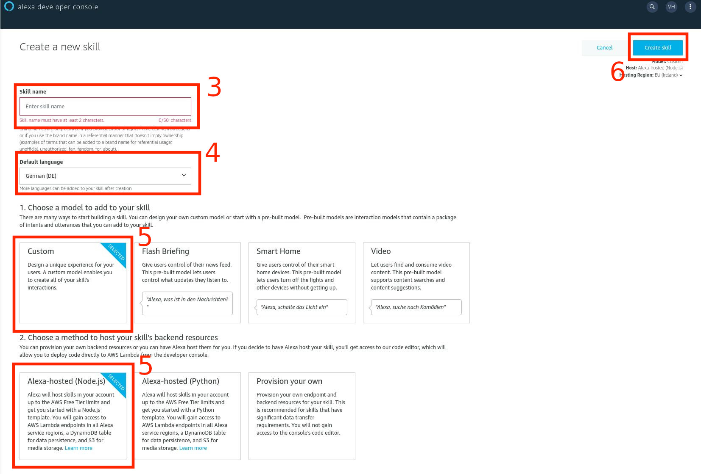
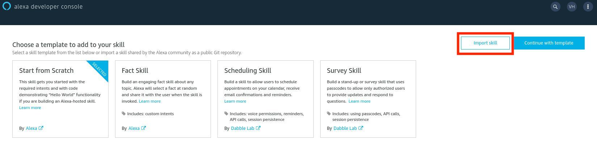
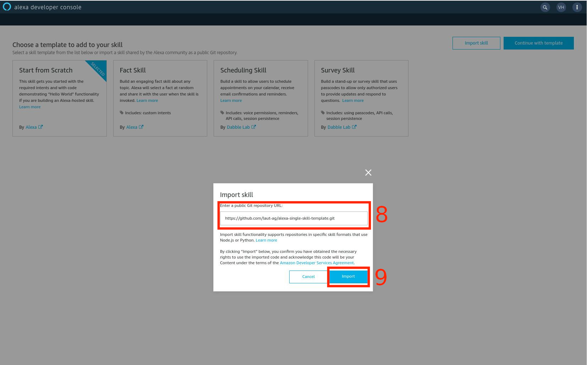
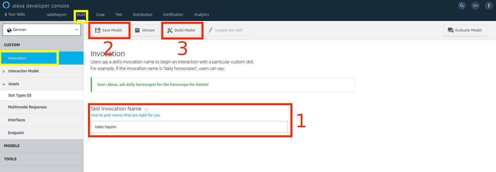
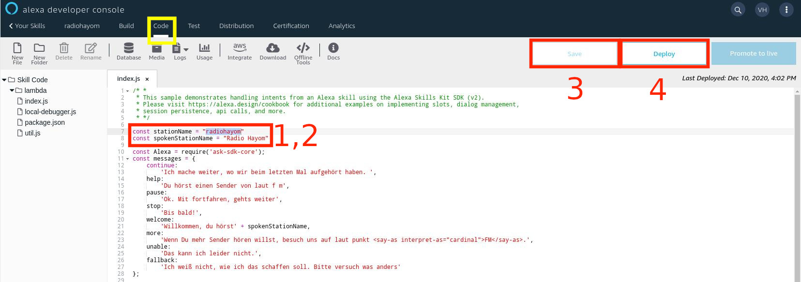
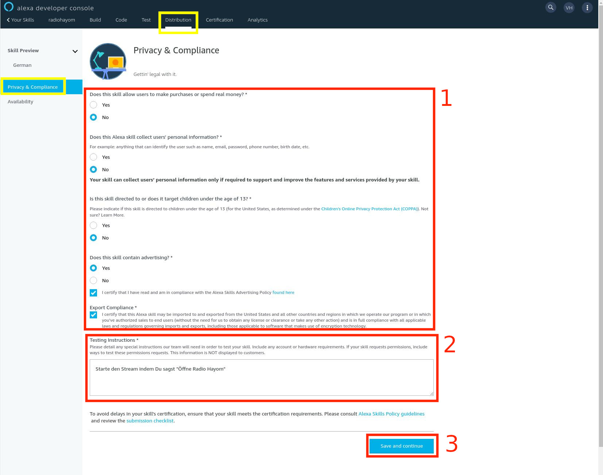
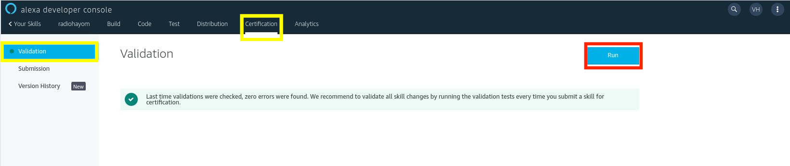
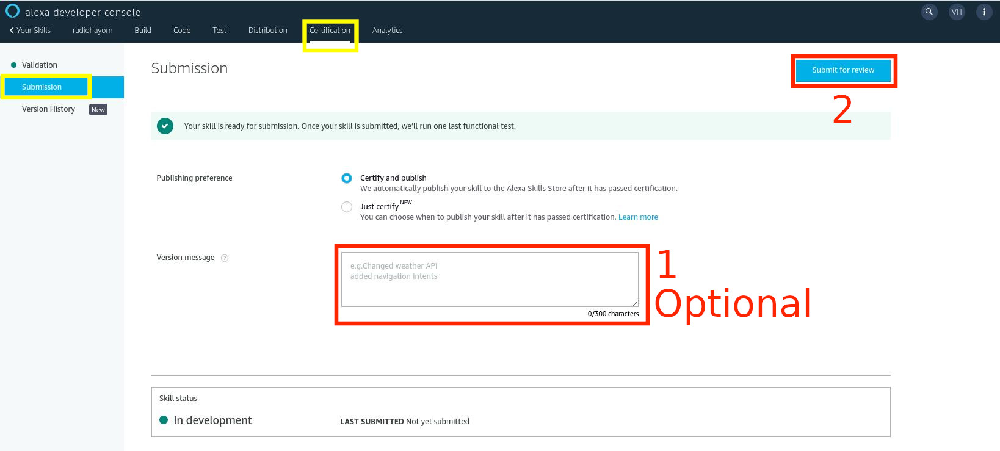

# Alexa Single-Skill Template

## Anleitung

### Create Skill

1. Logge dich auf <https://developer.amazon.com/alexa/console/ask/> ein (dazu benötigst du ein Amazon-Konto).
2. Klicke auf **Create New Skill**
3. Gib den gewünschten Namen unter **Skill name** ein.
4. Wähle bei **Default language** -> **German(DE)** aus.
5. Wähle **Custom** und **Alexa-hosted (Node.js)** aus.
6. Klicke auf **Create skill**

7. Klicke auf **Import skill**

8. Füge <https://github.com/laut-ag/alexa-single-skill-template.git> im Textfeld ein.
9. Klicke auf **Import**


### Build -> Invocation

1. Gib den Aufruf-Namen unter **Skill Invocation Name** ein.
2. Klicke auf **Save Model**
3. Klicke auf **Build Model**


### Code

1. Passe `const stationName = "<dein Sendername>"` an:
2. Passe `const spokenStationName = "<dein ausgesprochener Sendername>"` an:

Ersetze `<dein Station-Name>` mit dem Namen, unter dem man deinen Stream hören kann. d.h. `stream.laut.fm/<dein Sendername>`.
Ersetze `<dein ausgesprochener Sendername>` mit dem Namen, den Alexa ___sagen___ soll.

3. Klicke auf **Save**
4. Klicke auf **Deploy** 



### Distribution -> Skill Preview -> German

1. Gib unter **Public Name** den Namen ein, der im Skill-Store angezeigt werden soll.
2. Gib eine kurze Beschreibung bei **One Sentence Description** ein.
3. Gib eine detaillierte Beschreibung bei **Detailed Description** ein
4. Gib mehrere **Example Phrases** ein, z.B.
```
Alexa, öffne <dein ausgesprochener Sendername>
Alexa, starte <dein ausgesprochener Sendername> 
```
5. Lade das **Small Skill Icon** (108x108px PNG oder JPG) hoch.
6. Lade das **Large Skill Icon** (512x512px PNG oder JPG) hoch.
7. Gib die **Keywords** ein.
8. Klicke auf **Save and continue**

### Distribution -> Privacy & Compliance

1. Bitte beantworte die Fragen gewissenhaft. Wenn du diese Skill-Vorlage nach Anleitung **ohne zusätzliche Anpassungen** verwendet hast, kannst du die Antworten aus dem unteren Scrennshot benutzen.
2. Passe diese Anweisung an und füge sie anschließend bei **Testing Instructions** ein:
```
Starte den Stream, indem Du "Öffne <dein Sendername>" sagst.
```
3. Klicke auf**Save and continue**


### Test
Bitte teste den Skill. Das kannst du mit einem Amazon Echo oder mit der Alexa-App auf deinen Handy. Um den **Development** Skill zu testen, musst du dich mit demselben Amazon-Konto, mit dem du den Skill im **Developer Console** bearbeitest, auf deinem Test-Gerät einloggen.  

### Certification -> Validation

1. Klicke auf **Run**

2. Bearbeite alle angezeigten Fehler

Wiederhole Schritte 1 und 2,  bis kein Fehler mehr gemeldet wird. Dann kannst du mit dieser Anleitung fortfahren.

### Certification -> Submission

1. Gib eine (optionale) private Versions-Beschreibung bei **Version message** ein.
2. Reiche deinen Skill mit einem Klick auf **Submit for review** ein.


Jetzt musst du warten, bis Amazon deinen Skill bestätigt oder ablehnt. Falls sie den Skill ablehnen, solltest du eine E-Mail mit dem Grund für die Ablehnung bekommen. Wenn du alle Fehler behoben hast, kannst du den Skill erneut einreichen.
